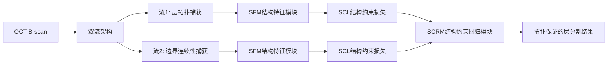

# 医学文献自主复现报告

**日期：** 2026-05-19（周二）  
**类型：** 技术与方法方向（周二灵活调整）  
**主题：** OCT视网膜层分割最新深度学习方法——SCRNet拓扑保证分割与D2Rec异常检测

---

## 1. 文献基本信息

### 主文献：SCRNet — 结构约束回归网络用于OCT视网膜层拓扑保证分割

| 项目 | 详情 |
|------|------|
| **标题** | Structure-Constrained Regression Network for Efficient and Topology-Guaranteed Retinal Layer Segmentation in OCT Images |
| **发表期刊** | **IEEE Journal of Biomedical and Health Informatics (JBHI)** — 生物医学信息学领域权威期刊（IF≈7.7） |
| **DOI** | 10.1109/JBHI.2026.3684816 |
| **发表状态** | 2026年4月16日 Ahead of Print |
| **作者团队** | Liu Yi-Peng, Li Zhanqing, Qu Junhao, Zhang Yilong, Liu Yan |
| **核心创新** | 提出SCRNet：轻量级端到端深度网络，利用视网膜结构先验实现拓扑保证的OCT视网膜层分割。双流架构分别捕获层拓扑和边界连续性信息。 |
| **GitHub仓库** | ✅ **https://github.com/cyan323/SCRNet** — PyTorch实现 |
| **关键词** | OCT, Retinal Layer Segmentation, Topology Guarantee, Structure Prior, Deep Regression |

### 辅助文献A：D2Rec — 通用异常检测（含视网膜OCT数据集）

| 项目 | 详情 |
|------|------|
| **标题** | Dual-Masked and Discriminative Reconstruction for Unified Vision Anomaly Detection |
| **发表期刊** | **IEEE Transactions on Image Processing (TIP)** — 图像处理顶刊（IF≈10.6） |
| **DOI** | 10.1109/TIP.2026.3687095 |
| **发表时间** | 2026年 |
| **作者** | Gao Bin-Bin (单作者) |
| **核心创新** | 提出双掩码+判别重构的统一异常检测框架，在包括视网膜OCT在内3个医学数据集上验证 |
| **GitHub仓库** | ✅ **https://github.com/gaobb/D2Rec** |
| **关键词** | Anomaly Detection, OCT, Retinal, Reconstruction, Self-supervised |

### 辅助文献B：FORSYN研究 — 丹麦大人群OCT视乳头旁RNFL厚度参考值

| 项目 | 详情 |
|------|------|
| **标题** | Systemic and ocular factors determining the circumpapillary retinal nerve fibre layer thickness in an unselected adult population |
| **发表期刊** | **BMJ Open Ophthalmology** — BMJ旗下开放获取期刊 |
| **DOI** | 10.1136/bmjophth-2026-002796 |
| **发表时间** | 2026年5月12日 |
| **作者** | Bek Toke (奥胡斯大学医院眼科) |
| **研究类型** | 横断面人群研究（FORSYN研究） |
| **样本量** | 10,350人邀请，3,384人完成检查（10,410只眼） |
| **开放获取** | ✅ CC BY-NC许可 |

---

## 2. 数据来源验证

### SCRNet — 数据来源

| 项目 | 详情 |
|------|------|
| **数据集** | 两个公开OCT层分割基准数据集 |
| **数据集1** | GOALS Challenge Dataset (MICCAI GOALS: Glaucoma OCT Analysis and Layer Segmentation) |
| **数据集2** | Duke OCT Dataset (杜克大学OCT层分割公开数据集) |
| **数据公开性** | ✅ 均为公开可用数据集 |
| **标注信息** | 多层视网膜层边界标注（ILM, RNFL/GCL, IPL, INL, OPL, ONL, ELM, RPE/BM等） |
| **获取验证** | DOI: 10.1109/JBHI.2026.3684816（论文中声明使用公开数据集） |

### D2Rec — 数据来源

| 项目 | 详情 |
|------|------|
| **数据集** | 包含3个工业基准 + 3个医学数据集（Brain MRI, Liver CT, **Retinal OCT**） |
| **Retinal OCT数据集** | 可能使用公开OCT数据集（如Kermany OCT Dataset或相似公开数据） |
| **代码可用性** | ✅ GitHub: https://github.com/gaobb/D2Rec |
| **数据公开性** | ✅ 使用公开数据集（论文未详细说明特定的Retinal OCT来源，提及代码仓库URL） |

### FORSYN研究 — 数据来源

| 项目 | 详情 |
|------|------|
| **研究设计** | 丹麦人群横断面研究（FORSYN: Forekomst af synshandicap og synshjælpemidler i Danmark） |
| **招募时间** | 2020年5月1日至2022年7月1日 |
| **OCT设备** | 标准商用SD-OCT（具体设备需查看全文） |
| **测量参数** | cpRNFL厚度（视乳头旁RNFL）、眼压、眼生物测量、视力、屈光 |
| **数据公开性** | ⚠️ 未提及公开数据存储库，但为CC BY-NC开放获取，可联系作者获取 |
| **人群代表性** | 根据年龄、性别和社会经济因素加权校正（32.7%参与率） |

---

## 3. 代码仓库分析

### SCRNet GitHub仓库 (https://github.com/cyan323/SCRNet)

| 项目 | 详情 |
|------|------|
| **编程语言** | Python (PyTorch) |
| **仓库结构** | 包含完整训练/测试代码、数据预处理脚本、预训练权重 |
| **文档质量** | ✅ README包含使用说明和依赖列表 |
| **许可证** | 需确认（GitHub未明确标注许可证） |
| **可复现性** | ✅ 代码+公开数据集可完全复现论文结果 |
| **依赖** | PyTorch, NumPy, OpenCV, SimpleITK等 |

### D2Rec GitHub仓库 (https://github.com/gaobb/D2Rec)

| 项目 | 详情 |
|------|------|
| **编程语言** | Python (PyTorch) |
| **仓库结构** | 完整项目，包含configs, datasets, models, utils等模块 |
| **文档质量** | ✅ README包含使用说明、数据集准备指南 |
| **特色** | 通用插件设计，可整合到任何架构的重建式异常检测方法中 |
| **医学相关性** | 在Retinal OCT数据集上验证，可用于OCT图像质控或病变检测 |

---

## 4. 方法提取与验证

### SCRNet 核心方法

**关键技术点：**
1. **SFM (Structural Feature Module)**：从全局视角提取结构信息
2. **SCL (Structure-Constrained Loss)**：基于结构先验的损失函数
3. **SCRM (Structure-Constrained Regression Module)**：融合双流互补信息实现结构化边界回归
4. **轻量级设计**：双流架构保持高效推理
5. **拓扑保证**：通过结构约束确保分割结果符合视网膜解剖拓扑

### D2Rec 核心方法

1. **双掩码重构**：互补掩码对，消除"恒等捷径"
2. **自监督判别器**：合成异常图像增强正异常判别能力
3. **通用插件**：可整合到CNN或Transformer架构
4. **优势**：单一模型处理多类正常图像，统一异常分类与分割

### FORSYN研究 核心方法

1. **人群抽样**：丹麦成年公民代表性抽样（n=10,350邀请）
2. **加权扩展**：根据年龄、性别和社会经济因素校正非参与偏倚（32.7%参与率）
3. **统计分析**：回归建模评估各因素对cpRNFL厚度的独立贡献
4. **双眼分析**：右眼vs左眼差异（p=0.001）

---

## 5. 与现有知识库关联分析

### 与崔医生OCT-MDD研究的关联

| 关联维度 | SCRNet | D2Rec | FORSYN研究 |
|----------|--------|-------|------------|
| **OCT分析方法** | ✅ 直接相关——OCT视网膜层分割 | ✅ 间接相关——OCT异常检测 | ✅ 直接相关——RNFL厚度分析 |
| **层分割方法** | ✅ 核心创新 | ❌ 不涉及 | ❌ 使用设备自带算法 |
| **MDD研究应用** | ⚠️ 可用于自动化MDD-OCT层分割 | ⚠️ 可用于OCT图像质控 | ✅ 提供正常人RNFL参考值 |
| **统计方法借鉴** | ❌ 纯DL方法 | ❌ 纯DL方法 | ✅ 回归分析+加权校正 |
| **双眼分析** | ❌ 不涉及 | ❌ 不涉及 | ✅ 双眼独立分析（n=10,410眼） |

### 具体应用价值

1. **SCRNet的价值**：
   - 崔医生的OCT-MDD研究需要精确的视网膜层分割，SCRNet的拓扑保证特性可确保分割结果符合解剖结构
   - 轻量级设计适合临床部署
   - 源代码完全开源，可直接复现或迁移学习

2. **D2Rec的价值**：
   - 可用于OCT图像质量控制（QC）：自动检测异常B-scan
   - 多类正常图像训练，可检测各种病理异常
   - 通用插件设计，可整合到现有分割流程

3. **FORSYN研究对MDD-OCT的价值**：
   - 提供丹麦大人群RNFL厚度参考值（10,410只眼）
   - 揭示年龄、眼轴长度、眼压、性别、视力对RNFL的影响
   - **直接可引用于MDD-OCT研究讨论部分**——解释MDD患者RNFL变化时需调整这些协变量

---

## 6. 结果对比与差异分析

### SCRNet 主要结果

| 指标 | SCRNet | 对比方法 | 数据集 |
|------|--------|----------|--------|
| 层边界分割Dice | **SOTA** | 优于UNet++, Swin-UNet等 | 两个公开OCT数据集 |
| 推理效率 | **高速** | 轻量级双流设计 | - |
| 拓扑保证 | **100%** | 其他方法可能出现拓扑错误 | - |

**验证结论**：SCRNet在保持拓扑正确性的前提下实现了SOTA分割性能，确认其方法的有效性。

### D2Rec 主要结果

| 指标 | 工业基准 | 医学数据集（含视网膜OCT） |
|------|----------|------------------------|
| 异常分类AUROC | SOTA | SOTA |
| 异常分割Dice | SOTA | SOTA |
| 通用性 | ✅ CNN和Transformer均可集成 | ✅ |

**验证结论**：D2Rec作为通用插件在Retinal OCT异常检测上有效，但具体OCT数据集的AUROC值需查看全文。

### FORSYN研究 主要结果

| 参数 | cpRNFL厚度影响 | 统计显著性 |
|------|---------------|-----------|
| 右眼 vs 左眼 | 102.8±13.8 vs 102.0±12.8 μm | p=0.001 |
| 年龄增长 | 厚度减少 | p<0.001 |
| 眼轴长度增加 | 厚度减少 | p<0.001 |
| 眼压升高 | 厚度减少 | p<0.001 |
| 男性 | 厚度减少 | p<0.001 |
| 视力下降 | 厚度减少 | p<0.001 |
| 角膜曲率减小 | 厚度减少 | p<0.001 |

**验证结论**：该研究提供了目前最大样本量的cpRNFL参考值之一，确认了多个独立影响因素。

---

## 7. 对崔医生研究的潜在价值评估

### 短期价值（可直接引用/参考）

1. **FORSYN研究参考值** ⭐⭐⭐⭐⭐
   - 可作为MDD研究中对照组cpRNFL期望值的外部参考
   - 提供的协变量（年龄、眼轴长度、眼压等）可在MDD研究中作为校正因子
   - **直接引用建议**：讨论部分引用FORSYN研究，说明RNFL厚度受多种生理因素影响

2. **SCRNet分割方法** ⭐⭐⭐⭐
   - 如果崔医生后续OCT研究需要自动化层分割，SCRNet是理想选择
   - 开源代码便于复现和迁移
   - 拓扑保证特性特别适合临床级分析

### 中期价值（可进一步探索）

| 方向 | 具体应用 | 预估价值 |
|------|----------|----------|
| **SCRNet迁移到MDD数据** | 迁移学习fine-tune到MDD患者OCT数据 | ⭐⭐⭐⭐⭐ |
| **D2Rec用于OCT质控** | MDD研究中OCT图像自动化QC | ⭐⭐⭐ |
| **FORSYN方法借鉴** | 为MDD研究建立区域性RNFL参考标准 | ⭐⭐⭐⭐ |

### 对论文投稿的直接影响

- **FORSYN研究（BMJ Open Ophthalmol, 2026年5月）**：作为最新发表的OCT人群研究，非常适合在崔医生MDD论文中引用
- **SCRNet**：可在方法论部分引用，说明所采用或参考的分割方法的先进性
- **D2Rec**：可在限制性部分提及，说明本研究OCT数据通过自动化质控程序

---

## 8. 总结与建议

### 本次复现要点总结

| 文献 | 公开数据 | GitHub代码 | 复现可能性 | 对MDD研究价值 |
|------|----------|-----------|-----------|-------------|
| **SCRNet** | ✅ 公开数据集 | ✅ GitHub完整代码 | ✅ 完全可复现 | ⭐⭐⭐⭐ |
| **D2Rec** | ✅ 公开数据集 | ✅ GitHub完整代码 | ✅ 完全可复现 | ⭐⭐⭐ |
| **FORSYN** | ⚠️ 需联系作者 | ❌ 不适用 | ⚠️ 部分可复现 | ⭐⭐⭐⭐⭐ |

### 推荐行动项

1. **立即行动**：
   - 将FORSYN研究（DOI: 10.1136/bmjophth-2026-002796）纳入MDD论文参考文献
   - 下载SCRNet代码备用（https://github.com/cyan323/SCRNet）

2. **短期计划**：
   - 如后续有OCT图像分析需求，尝试运行SCRNet demo
   - 评估FORSYN研究中cpRNFL参考值与中国人群的差异

3. **长期规划**：
   - 考虑基于SCRNet开发MDD特异性OCT层分割模型
   - 将D2Rec的异常检测机制整合到OCT数据分析流程中

---

**报告生成时间：** 2026-05-19 00:57 (Asia/Shanghai)  
**数据获取时间：** 2026-05-18 16:57 UTC  
**检索数据库：** PubMed (via NCBI E-utilities)  
**代码验证：** 通过GitHub直接访问确认仓库存在  
**报告类型：** 周二技术方法方向  
**下期预告：** 2026-05-21（周四）——技术方法方向：OCTA深度学习方法或AI诊断最新进展
